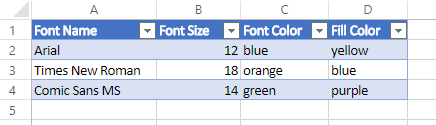
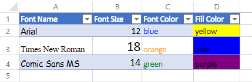
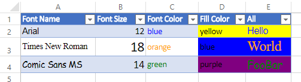

_[Home page](index.md)_


# Exercise

## Setup
Copy the following data, and paste it into Excel.

| Font Name  | Font Size | Font Color | Fill Color |
| ---------- | --------- | ---------- | ---------- |
| Arial      | 12        | blue       | yellow     |
| Times New Roman | 18   | orange     | blue       |
| Comic Sans MS | 14     | green      | purple     |

Select the pasted data and goto `Insert` > `Table` to turn this data into a table. The result should look like this:



## Problem
The objective of this exercise is to set formatting on each cell of the table body. Each column of the table is a different property to set. Each row has different values for each property.

## Desired Output

## Phases

See above for the desired output. This problem has been broken up into multiple phases each with increasing difficulty. *Feel free to start at whichever phase you feel comfortable with, and work your way up.*
### **Phase 1**
For this phase, don't worry about the column headers.

Assume:
* Change the `Font Name` for range `A2:A4`
* Change the `Font Size` for range `B2:B4`
* Change the `Font Color` for range `C2:C4`
* Change the `Fill Color` for range `D2:D4`

### **Phase 2**
Now, adjust your solution so that it works with any number of rows in the table.

>**HINT:** Tables can be retrieved via the following statement:
```typescript
const table = workbook.tables.getItem('Table1');
const rowRange = table.getDataBodyRange();
```

### **Phase 3**
Now, make it work with the columns being in any random order.

>**HINT:** You can get the range of the headers in a table.


### **Phase 4**
Now add a column to the right of the table titled `All`.

Insert random test data for the values of this column. (Ex: Foo, Hello World, Bar...)


In this phase, the goal is to apply each of the different properties to their respective value in the `All` column.



## Survey
Please continue to the [survey](https://forms.office.com/Pages/ResponsePage.aspx?id=v4j5cvGGr0GRqy180BHbR1cd-yOFfWxAkdFfv4kfuiVUMTJZRjZKRVMyNE9HM0dHTTNET0c5VjE2Vi4u).