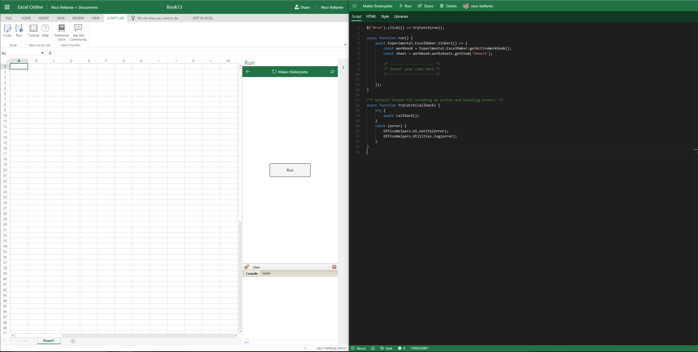
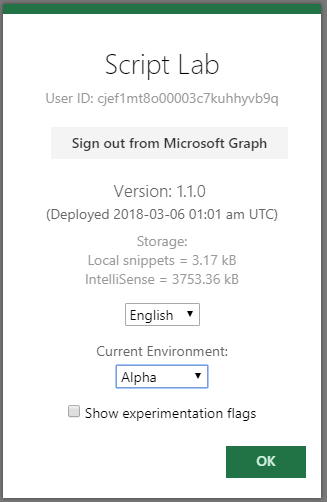
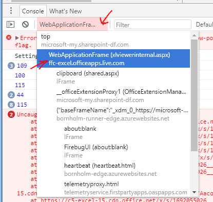
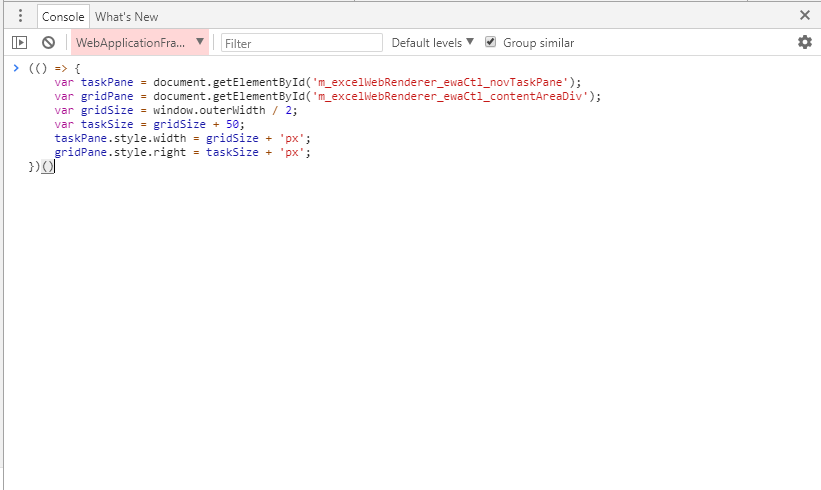
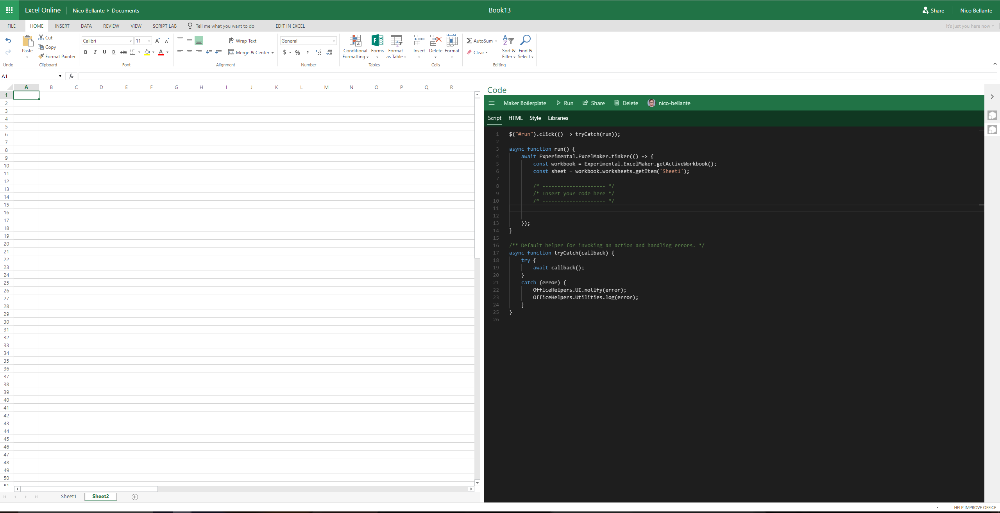

_[Home page](index.md)_


# Walkthrough
## Step 1: Window Arrangement
<!-- 
Arrange your windows as seen in the screenshot above.

(You can split your screen by pressing `⊞ Win` + `Left Arrow` / `Right Arrow`, or drag to the edge of your screen.)
### Left Side
On the left, open [Excel Online](https://office.live.com/start/excel.aspx). Create a workbook and insert the Script Lab addin. (See [setup](../misc/setup.md) for information on how to add Script Lab to the workbook.)
### Right Side
Navigate to [Script Lab](https://bornholm-edge.azurewebsites.net/) in a seperate window.

## Alternative for Smaller Screens
If your screen is too small to layout your windows in the method described above, you can do the following. **If the above window configuration works for you, you can skip ahead to step 2**. -->

Open Google Chrome.

Add `Script Lab` to the workbook. `Insert` > `Office Add-ins` > `Script Lab`. (See [setup](../misc/setup.md) for more detailed information on how to add Script Lab to the workbook.)

Switch to `Alpha` mode.




Open up the developer tools console (`F12`).

Select the proper window.



Copy the following code:
```javascript
(() => {
    var taskPane = document.getElementById('m_excelWebRenderer_ewaCtl_novTaskPane');
    var gridPane = document.getElementById('m_excelWebRenderer_ewaCtl_contentAreaDiv');
    var gridSize = window.outerWidth / 2;
    var taskSize = gridSize + 50;
    taskPane.style.width = gridSize + 'px';
    gridPane.style.right = taskSize + 'px';
})()
```

and paste it into the console as shown below.



Your screen should now look like this once you close the developer tools:



>**Note:** You will have to paste this code in again if you close/minimize the addin.

## Step 2: Import the Template
On the right side, import the following snippet:

`https://gist.github.com/nico-bellante/cf72a3a814115dffa2a4ec13ec391368`

### How to Import a Snippet


## Step 3: Basic "Hello World"
After importing the snippet, navigate to the `Script` tab on the editor. There should be comments on lines 8-10 saying `Insert your code here`. This is where you will be placing your code. (If you're rusty in Javascript, you can find a [cheatsheet here](http://htmlcheatsheet.com/js/).)

### Problem
Place the text `Hello World!` into cell `B4`.

### Solution
* Get reference to `B4`
* Set that reference's `values` to `'Hello World!'`

#### Getting a reference to a range
There are multiple ways to get references to certain Excel objects. If only a single cell is desired, we could call:
```typescript
const cell = sheet.getCell(3, 1);   // Note: (row, column) are 0-based indicies
```
To get a more general-purposed range, we could call:
```typescript
const range = sheet.getRange('B4');
```

#### Setting Values
The values of this range can be set by the following:
```typescript
range.values = [['Hello World']];   // Note: [[2D array]] because still a range
```


## Step 4: Apply Some Formatting
We can use the range object from the previous step to apply formatting as well.

### Font Color
```typescript
range.font.color = 'red';
```
### Font Size
```typescript
range.font.size = 24;
```
### Problem
* Set the **font color** of `B4` to be **blue**.
* Set the **font size** of `B4` to be **16**.

## Final Solution
The resulting code should look something like:
```typescript
await Experimental.ExcelMaker.tinker(() => {
    const workbook = Experimental.ExcelMaker.getActiveWorkbook();
    const sheet = workbook.worksheets.getItem('Sheet1');

    const range = sheet.getRange('B4');

    range.values = [['Hello World!']];

    range.format.font.color = 'blue';
    range.format.font.size = 16;
});
```